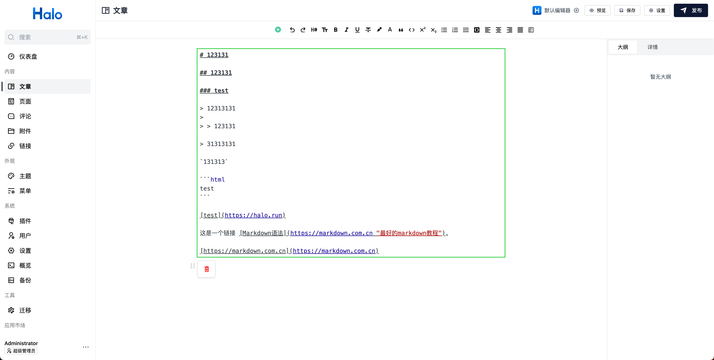

# 默认富文本编辑器的 Markdown / HTML 内容块扩展

本插件是 Halo 默认富文本编辑器的扩展插件，允许你在默认编辑器中插入 `HTML` 及 `Markdown` 块，用于撰写 HTML 或 Markdown 代码。

## 预览

### HTML 编辑块


### Markdown 编辑块



## 用法

1. 在 [Halo](https://www.halo.run/) 中安装此插件并启用
2. 在编辑器中点击 `+` 按钮，或者使用 `/` 快捷键, 选择 `HTML` 或 `Markdown` 编辑块

    

3. 在 `HTML` 或 `Markdown` 编辑块中编写代码
4. 点击 `保存` 按钮，即可在文章中看到效果

## 开发

1. fork 此仓库

    ```bash
    https://github.com/halo-sigs/plugin-hybrid-edit-block/fork
    ```

2. 克隆自己的分支到本地

    ```#55c6a0
    git clone https://github.com/{you-name}/plugin-hybrid-edit-block
    ```

3. 安装依赖

    ```#55c6a0
    cd path/to/plugin-hybrid-edit-block/console 

    pnpm install

    pnpm dev
    ```

4. 打包最终产物

    ```#55c6a0
    ./gradlew clean build
    ```

## 常见问题

<details>
<summary>1. 是否支持 `style` 及 `script` 标签？</summary>

支持。但建议编写时将作用范围限制在较小范围内。

</details>

<details>
<summary>2. Markdown 编辑块中的回显内容与编写时的语法不一致？</summary>

由于 Markdown 编辑器最终产物是 HTML，因此回显的内容是基于 HTML 根据规则反解析的，因此可能与编写时的语法不一致。例如

```
* First item
* Second item
* Third item
* Fourth item
```

回显之后将会变成

```
- First item
- Second item
- Third item
- Fourth item
```

</details>

<details>
<summary>3. 停止使用此插件之后，之前编辑的内容会丢失吗？</summary>

之前编辑的内容不会丢失，但由于没有了插件支持，将无法正常显示。

</details>
